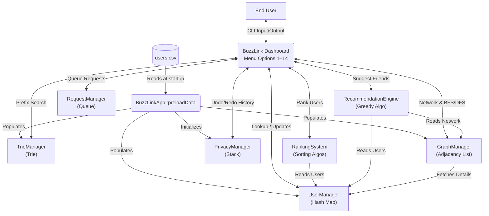
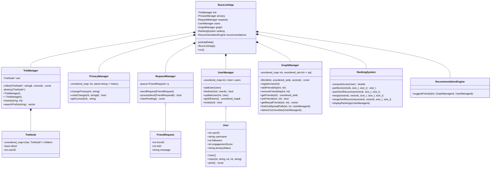

# 🐝 BuzzLink — Social Media Backend Simulation in C++

> A fully object-oriented, menu-driven social networking backend built in C++ that demonstrates the **practical application of 8 core Data Structures and Algorithms** — Trie, Stack, Queue, Hash Map, Graph (BFS/DFS), Sorting Algorithms, and Greedy Optimization — in the context of a real-world platform managing 1,000+ users.

---

## 📖 Table of Contents

- [Overview](#-overview)
- [Features at a Glance](#-features-at-a-glance)
- [Getting Started](#-getting-started)
- [Project Structure](#-project-structure)
- [System Architecture](#%EF%B8%8F-system-architecture)
- [Class Diagram](#-class-diagram)
- [DSA Concepts — In-Depth Breakdown](#-dsa-concepts--in-depth-breakdown)
  - [1. Trie — User Directory](#1-trie--user-directory)
  - [2. Stack — Privacy History](#2-stack--privacy-history)
  - [3. Queue — Friend Requests](#3-queue--friend-requests)
  - [4. Hash Map — User Lookup](#4-hash-map--user-lookup)
  - [5. Sorting Algorithms — Influencer Rankings](#5-sorting-algorithms--influencer-rankings)
  - [6. Graph (Adjacency List) — Friend Network](#6-graph-adjacency-list--friend-network)
  - [7. BFS — Shortest Path / Viral Spread](#7-bfs--shortest-path--viral-spread)
  - [8. DFS — Community Detection](#8-dfs--community-detection)
  - [9. Greedy Algorithm — Friend Recommendations](#9-greedy-algorithm--friend-recommendations)
- [Time & Space Complexity Summary](#-time--space-complexity-summary)
- [Menu Options Guide](#-menu-options-guide)
- [Sample Input / Output](#-sample-input--output)
- [License](#-license)

---

## 🌐 Overview

**BuzzLink** simulates the backend of a micro-blogging social media platform. It models core social networking operations — user management, friendship graphs, privacy controls, content virality paths, influencer rankings, and intelligent friend recommendations — all powered by carefully chosen data structures and algorithms.

The system pre-loads **1,000 users** from a CSV dataset, generates a realistic random social graph (~3,000 friendship edges), and exposes all functionality through a color-coded interactive terminal dashboard.

### Why BuzzLink?

Social media platforms are one of the richest real-world applications of DSA. Every feature maps naturally to a classic data structure or algorithm:

| Real-World Problem | DSA Solution |
|---|---|
| "Search users as I type" | **Trie** (Prefix Tree) |
| "Undo my privacy change" | **Stack** (LIFO) |
| "Process requests in order" | **Queue** (FIFO) |
| "Instant user profile lookup" | **Hash Map** |
| "Rank top influencers" | **Sorting Algorithms** |
| "Who are our mutual friends?" | **Graph** (Adjacency List) |
| "How does a post go viral?" | **BFS** (Breadth-First Search) |
| "Find isolated communities" | **DFS** (Depth-First Search) |
| "People you may know" | **Greedy Algorithm** |

---

## ✨ Features at a Glance

- 🔍 **Prefix-based username autocomplete** using a Trie
- 🔒 **Privacy setting management** with full undo history via Stack
- 📬 **Fair friend request processing** through a FIFO Queue
- ⚡ **O(1) user lookups** via Hash Map
- 🏆 **Influencer leaderboard** with side-by-side Quick Sort / Merge Sort / STL Sort benchmarks
- 🌐 **Social graph** with friendship management, mutual friends, and community detection
- 🚀 **Viral spread path finder** using BFS shortest path
- 🤝 **Smart friend recommendations** powered by Greedy optimization
- 🎨 **ANSI color-coded terminal UI** for a polished interactive experience
- 📊 **1,000+ user dataset** pre-loaded from CSV with auto-generated graph edges

---

## 🚀 Getting Started

### Prerequisites

- A C++ compiler supporting **C++11** or later (g++, clang++, MSVC)
- Terminal / Command Line

### Compile

```bash
g++ -std=c++11 -O2 -o buzzlink buzzlink.cpp
```

### Run

```bash
./buzzlink
```

> **Note:** Ensure `users.csv` is in the same directory as the compiled binary. The program will load fallback data if the CSV is not found.

---

## 📁 Project Structure

```
BuzzLink/
├── buzzlink.cpp        # Complete C++ source — all DSA logic in a single file
├── users.csv           # Dataset of 1,000 users (id, username, followers, engagement, privacy)
├── LICENSE             # MIT License
└── README.md           # This file
```

---

## 🏛️ System Architecture

The application follows a **modular OOP architecture** where each DSA concept is encapsulated in its own manager class. The central `BuzzLinkApp` class orchestrates all components:



### Data Flow

1. **Startup** → `preloadData()` reads `users.csv`, populates the Hash Map, Trie, Graph, and Privacy Stack for all 1,000 users. Random friendship edges (~3,000) are generated with a fixed seed for reproducibility.
2. **Runtime** → The interactive dashboard routes user menu choices to the appropriate manager class.
3. **Each manager is independent** — they communicate only through well-defined public interfaces, making the system easy to extend.

---

## 📐 Class Diagram



---

## 🧠 DSA Concepts — In-Depth Breakdown

### 1. Trie — User Directory

**Class:** `TrieManager` • **Menu Option:** 2 (Search User by Prefix)

#### What is a Trie?

A **Trie** (pronounced "try"), also called a **Prefix Tree**, is a tree-like data structure where each node represents a single character of a string. Strings that share common prefixes share the same path from the root, making prefix-based lookups extremely efficient.

#### How It Works in BuzzLink

```
Root
├── a
│   ├── l
│   │   ├── i → c → e   ✓ "alice" (userID: 101)
│   │   └── e → x       ✓ "alex"  (userID: 205)
│   └── n → n → a       ✓ "anna"  (userID: 310)
├── b
│   └── o → b           ✓ "bob"   (userID: 102)
...
```

When a user types the prefix `"al"`, the Trie:
1. Traverses `root → 'a' → 'l'` in **O(L)** time (L = prefix length).
2. Collects all descendants from that node using DFS, returning `["alice", "alex"]`.

#### Why Not Use a Hash Map or Array?

| Approach | Prefix Search Time | Problem |
|---|---|---|
| **Array scan** | O(N × L) | Must check every username |
| **Hash Map** | O(N) | Only supports exact-match; no prefix search |
| **Trie** | **O(L + K)** | L = prefix length, K = matches. Independent of N |

#### Key Code

```cpp
void insert(const string& username, int userID) {
    TrieNode* cur = root;
    for (char c : username) {
        if (!cur->children.count(c))
            cur->children[c] = new TrieNode();
        cur = cur->children[c];
    }
    cur->isEnd = true;
    cur->userID = userID;
}
```

---

### 2. Stack — Privacy History

**Class:** `PrivacyManager` • **Menu Options:** 3 (Change), 4 (Undo)

#### What is a Stack?

A **Stack** is a linear data structure that follows the **Last-In, First-Out (LIFO)** principle. The last element pushed onto the stack is the first one to be popped off — just like a stack of plates.

#### How It Works in BuzzLink

Each user has their own stack of privacy states. Every time a privacy setting changes, the new state is pushed. Undo simply pops the current state to reveal the previous one:

```
User 101's Privacy Stack:

  push("PUBLIC")  →  | PUBLIC  |     (initial state)
  push("PRIVATE") →  | PRIVATE |     (user changed to private)
                      | PUBLIC  |
  pop()            →  | PUBLIC  |     (undo! reverted to public)
```

#### Why a Stack?

Undo operations are inherently **LIFO** — you always want to revert to the *most recent* previous state. A stack models this perfectly with **O(1)** push and pop operations. Using an array or list would require tracking an index pointer manually.

---

### 3. Queue — Friend Requests

**Class:** `RequestManager` • **Menu Options:** 5 (Send), 6 (Process)

#### What is a Queue?

A **Queue** is a linear data structure that follows the **First-In, First-Out (FIFO)** principle. Elements are added at the back (enqueue) and removed from the front (dequeue) — just like a line at a ticket counter.

#### How It Works in BuzzLink

```
Send request (Alice → Bob)    →  Queue: [ Alice→Bob ]
Send request (Charlie → Eve)  →  Queue: [ Alice→Bob, Charlie→Eve ]
Process next request           →  Processes Alice→Bob first (FIFO fairness)
                                  Queue: [ Charlie→Eve ]
```

#### Why a Queue?

Friend requests must be handled **fairly** — the first request sent should be the first one processed. A Queue naturally enforces this chronological ordering with **O(1)** enqueue and dequeue operations.

---

### 4. Hash Map — User Lookup

**Class:** `UserManager` • **Menu Options:** 1 (Add User), 7 (Find User by ID)

#### What is a Hash Map?

A **Hash Map** (implemented as `std::unordered_map` in C++) is a key-value store that uses a **hash function** to compute an index into an array of buckets. This allows for near-instant lookups by key.

#### How It Works in BuzzLink

```
Hash Function: hash(userID) → bucket index

  users[101] → { id:101, name:"alice", followers:5000, ... }    O(1) lookup
  users[102] → { id:102, name:"bob",   followers:3200, ... }    O(1) lookup
  users[205] → { id:205, name:"alex",  followers:8100, ... }    O(1) lookup
```

The `UserManager` stores all 1,000 user profiles in an `unordered_map<int, User>`. Any operation — add, find, update, check existence — runs in **O(1) average time**.

#### Why Not a Sorted Array or BST?

| Approach | Lookup Time | Insertion Time |
|---|---|---|
| **Sorted Array** | O(log N) binary search | O(N) shifting |
| **BST** | O(log N) | O(log N) |
| **Hash Map** | **O(1)** average | **O(1)** average |

For a system that constantly looks up users by ID, the hash map's constant-time performance is unbeatable.

---

### 5. Sorting Algorithms — Influencer Rankings

**Class:** `RankingSystem` • **Menu Option:** 8 (Display Influencer Rankings)

#### What Sorting Algorithms Are Used?

BuzzLink implements **three sorting algorithms** and benchmarks them against each other:

##### Quick Sort

A **divide-and-conquer** algorithm that:
1. Picks a **pivot** element (BuzzLink uses the middle element to avoid worst-case on sorted data).
2. **Partitions** the array: elements greater than the pivot go left, smaller go right.
3. **Recursively** sorts both halves.

```
[ 82, 45, 91, 23, 67 ]  →  pivot=91
[ 91 | 82, 67, 45, 23 ]  →  sort sub-arrays
[ 91, 82, 67, 45, 23 ]   →  sorted (descending)
```

- **Average:** O(N log N) • **Worst:** O(N²) • **Space:** O(log N)

##### Merge Sort

A **stable divide-and-conquer** algorithm that:
1. **Splits** the array in half.
2. **Recursively** sorts each half.
3. **Merges** the two sorted halves back together.

```
[ 82, 45, 91, 23 ]
      /        \
 [ 82, 45 ]  [ 91, 23 ]
   /    \       /    \
 [82]  [45]  [91]  [23]
   \    /       \    /
 [ 82, 45 ]  [ 91, 23 ]       ← merge step
      \          /
 [ 91, 82, 45, 23 ]           ← final merge
```

- **Guaranteed:** O(N log N) • **Space:** O(N)

##### STL Sort (`std::sort`)

C++'s built-in `std::sort` uses **IntroSort** — a hybrid of Quick Sort, Heap Sort, and Insertion Sort. It starts with Quick Sort, switches to Heap Sort if recursion depth exceeds a threshold, and uses Insertion Sort for small sub-arrays.

- **Guaranteed:** O(N log N) • **Highly optimized** in practice

#### Influence Score Formula

```
Score = followers × 0.7 + engagementScore × 0.3
```

The system sorts all users by this weighted score and displays the Top 10 leaderboard, along with nanosecond-precision timing for each algorithm.

---

### 6. Graph (Adjacency List) — Friend Network

**Class:** `GraphManager` • **Menu Options:** 9 (Add Friendship), 10 (Mutual Friends)

#### What is a Graph?

A **Graph** consists of **vertices** (nodes) and **edges** (connections). In BuzzLink, users are vertices and friendships are undirected edges.

#### Adjacency List Representation

Instead of a dense V×V matrix, an **Adjacency List** stores only the actual connections:

```
User 101: { 102, 205, 310 }     ← Alice is friends with Bob, Alex, Anna
User 102: { 101, 310 }          ← Bob is friends with Alice, Anna
User 205: { 101 }               ← Alex is friends with Alice
User 310: { 101, 102 }          ← Anna is friends with Alice, Bob
```

Implemented as `unordered_map<int, unordered_set<int>>`, this gives:
- **O(1)** friendship insertion and lookup
- **O(V + E)** space (not V²)

#### Why Adjacency List Over Adjacency Matrix?

Social graphs are **extremely sparse**. With 1,000 users:
- **Adjacency Matrix:** 1,000 × 1,000 = **1,000,000 cells** (99.7% zeroes)
- **Adjacency List:** Only stores ~3,000 actual edges = **~6,000 entries**

#### Mutual Friends Algorithm

To find mutual friends between users A and B:
1. Get the friends set of A and B.
2. Iterate over the **smaller** set.
3. Check if each friend exists in the **larger** set (O(1) hash set lookup).

This runs in **O(min(D_A, D_B))** time where D is the degree (number of friends).

---

### 7. BFS — Shortest Path / Viral Spread

**Class:** `GraphManager::findViralSpreadPath` • **Menu Option:** 12

#### What is BFS?

**Breadth-First Search** explores a graph **level by level** — visiting all nodes at distance 1 first, then distance 2, then distance 3, and so on. This guarantees that the **first time** BFS reaches a node, it has found the **shortest path** to it.

#### How It Works in BuzzLink

BFS finds the shortest "viral spread path" between two users — the minimum number of hops a post would take to travel from user A to user B through the friendship network:

```
Source: Alice (101)  →  Destination: Grace (107)

Level 0: { Alice }
Level 1: { Bob, Alex, Anna }         ← Alice's direct friends
Level 2: { Charlie, Eve, Diana }     ← friends of friends
Level 3: { Grace }                   ← FOUND! 3 hops

Path: @alice → @charlie → @eve → @grace
```

#### Algorithm Steps

1. Start from the source node, push it into a queue.
2. While the queue is not empty:
   - Dequeue the front node.
   - If it's the destination → reconstruct the path using the parent map.
   - Otherwise, enqueue all unvisited neighbors and record their parent.
3. If the queue empties without finding the destination → users are disconnected.

**Time:** O(V + E) • **Space:** O(V)

---

### 8. DFS — Community Detection

**Class:** `GraphManager::detectCommunities` • **Menu Option:** 11

#### What is DFS?

**Depth-First Search** explores a graph by going **as deep as possible** along each branch before backtracking. It uses recursion (or an explicit stack) to dive deep into the graph.

#### How It Works in BuzzLink

DFS is used to find **connected components** — isolated groups of users who are all reachable from each other but disconnected from the rest of the network:

```
Graph:
  [A]—[B]—[C]    [D]—[E]    [F]

DFS from A → visits A, B, C  →  Community 1: {A, B, C}
DFS from D → visits D, E     →  Community 2: {D, E}
DFS from F → visits F        →  Community 3: {F}

Total Communities Detected: 3
```

#### Algorithm Steps

1. Maintain a global `visited` set.
2. For each unvisited user in the graph:
   - Start a new DFS traversal, collecting all reachable users into a `cluster`.
   - Each cluster is one community.
3. Sort communities by size and display the top 3 largest.

**Time:** O(V + E) • **Space:** O(V)

---

### 9. Greedy Algorithm — Friend Recommendations

**Class:** `RecommendationEngine` • **Menu Option:** 13

#### What is a Greedy Algorithm?

A **Greedy Algorithm** makes the **locally optimal choice** at each step, hoping to find a global optimum. It doesn't explore all possibilities — it picks the best available option immediately.

#### How It Works in BuzzLink

The recommendation engine suggests new friends based on **maximum mutual connections**:

```
User Alice's friends: { Bob, Charlie }

Bob's friends:    { Alice, Diana, Eve }
Charlie's friends: { Alice, Eve, Frank }

Candidates (not already Alice's friend):
  Eve   → mutual friends with Alice: 2 (via Bob AND Charlie)  ← BEST
  Diana → mutual friends with Alice: 1 (via Bob)
  Frank → mutual friends with Alice: 1 (via Charlie)

Greedy picks: Eve (highest mutual count)
```

#### Algorithm Steps

1. For each of the user's friends → iterate over **their** friends (friends-of-friends).
2. Skip anyone who is already a direct friend or the user themselves.
3. Count mutual connections for each candidate.
4. Sort candidates by mutual count (descending) — **greedy choice**.
5. Return the top 5 recommendations.

#### Why Greedy?

A more sophisticated approach might compute recommendation scores using machine learning or global graph analysis, but the greedy mutual-friend approach:
- Produces **highly relevant** suggestions (people your friends know)
- Runs in **O(D²)** time (D = average degree), which is very fast
- Avoids computationally expensive global optimizations

---

## 📊 Time & Space Complexity Summary

| # | Feature | DSA Used | Time Complexity | Space Complexity |
|---|---|---|---|---|
| 1 | User Directory | Trie | O(L) search | O(N × L) |
| 2 | Privacy History | Stack | O(1) push/pop | O(H) per user |
| 3 | Friend Requests | Queue | O(1) enqueue/dequeue | O(R) |
| 4 | User Lookup | Hash Map | O(1) average | O(N) |
| 5 | Influencer Rankings | Quick/Merge/STL Sort | O(N log N) | O(N) |
| 6 | Friend Network | Graph (Adj. List) | O(1) add edge | O(V + E) |
| 7 | Viral Spread Path | BFS | O(V + E) | O(V) |
| 8 | Community Detection | DFS | O(V + E) | O(V) |
| 9 | Friend Recommendations | Greedy | O(D²) | O(D²) |

> **Key:** N = users, L = string length, H = history depth, R = pending requests, V = vertices, E = edges, D = average degree

---

## 🎮 Menu Options Guide

```
  BUZZLINK SOCIAL PLATFORM DASHBOARD
----------------------------------------------------------------
  1. Add User                      9. Add Friendship
  2. Search User by Prefix        10. Find Mutual Friends
  3. Change Privacy Setting       11. Detect Communities
  4. Undo Privacy Change          12. Find Shortest Path Between Users
  5. Send Friend Request          13. Friend Recommendations
  6. Process Friend Request       14. Exit
  7. Find User by ID
  8. Display Influencer Rankings
----------------------------------------------------------------
```

| Option | What It Does | DSA Demonstrated |
|---|---|---|
| 1 | Register a new user into the system | Hash Map insertion + Trie insertion |
| 2 | Autocomplete usernames by prefix | Trie prefix traversal |
| 3 | Change a user's privacy (PUBLIC/PRIVATE) | Stack push |
| 4 | Undo the last privacy change | Stack pop |
| 5 | Send a friend request to another user | Queue enqueue |
| 6 | Process the oldest pending request | Queue dequeue |
| 7 | Look up a user's full profile by ID | Hash Map O(1) lookup |
| 8 | Display top influencers with sort benchmarks | Quick Sort + Merge Sort + STL Sort |
| 9 | Create a friendship between two users | Graph edge insertion |
| 10 | Find shared friends between two users | Graph set intersection |
| 11 | Discover isolated friend groups | DFS connected components |
| 12 | Find shortest connection between users | BFS shortest path |
| 13 | "People you may know" suggestions | Greedy mutual-friend maximization |
| 14 | Exit the application | — |

---

## 💻 Sample Input / Output

```
  BUZZLINK SOCIAL PLATFORM DASHBOARD
----------------------------------------------------------------
  Select option > 2

----------------------------------------------------------------
  2. Search User by Prefix (Trie)
----------------------------------------------------------------
  Prefix: al
  Found 3 match(es):
  @alice_j (ID: 101)
  @alex_m (ID: 205)
  @alyssa_b (ID: 308)

  Select option > 3

----------------------------------------------------------------
  3. Change Privacy Setting
----------------------------------------------------------------
  UserID: 101
  New Setting (PUBLIC/PRIVATE): PRIVATE
  Privacy updated.

  Select option > 4

----------------------------------------------------------------
  4. Undo Privacy Change (Stack)
----------------------------------------------------------------
  UserID: 101
  Reverted back to: PUBLIC

  Select option > 12

----------------------------------------------------------------
  12. Find Shortest Path Between Users
----------------------------------------------------------------
  Source ID: 101
  Dest ID: 107
  Viral path found in 3 hops!
  @alice_j -> @charlie_p -> @eve_o -> @grace_t

  Select option > 13

----------------------------------------------------------------
  13. Friend Recommendations
----------------------------------------------------------------
  UserID: 101
  Top Recommendations:
  @eve_o (105) - Mutual Friends: 2
  @diana_x (104) - Mutual Friends: 1

  Select option > 14
  Exiting BuzzLink...
```

---

## 📄 License

This project is licensed under the [MIT License](LICENSE).

---

<p align="center">
  Built with ❤️ and C++ — Demonstrating that Data Structures & Algorithms power the platforms we use every day.
</p>
